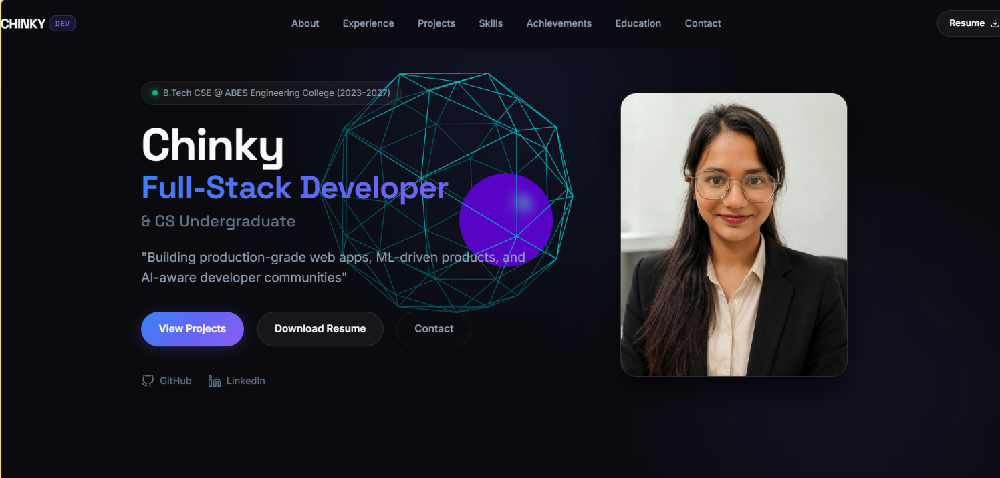

# ⚡ Chinky — Full-Stack Developer Portfolio

> *Building production-grade web apps, ML-driven products, and AI-aware developer communities.*

[](https://developer.mozilla.org/en-US/docs/Web/HTML)
[](https://developer.mozilla.org/en-US/docs/Web/CSS)
[](https://developer.mozilla.org/en-US/docs/Web/JavaScript)
[](https://threejs.org/)
[](https://tailwindcss.com/)

🔗 **Live Site**: [https://chinky29.github.io/Chinky_Portfolio/](https://chinky29.github.io/Chinky_Portfolio/) *(Replace with your deployed URL)*

---

## 📷 Preview


*(Replace `preview.png` with a screenshot of your deployed portfolio)*

---

## 💡 About

A modern, minimal, high-end SaaS portfolio website engineered for **Chinky** — Computer Science & Engineering undergraduate at ABES Engineering College (2023–2027) and Full-Stack Developer. Designed with a restrained, product-focused aesthetic inspired by Linear.app and Vercel.com.

---

## 🚀 Key Features

- 🎨 **Minimal SaaS Design System**: Ultra-dark void background (`#0A0A0F`), frosted glass panels (`backdrop-filter: blur(20px)`), and electric blue/indigo/violet gradients.
- 🧊 **Interactive 3D Hero Canvas**: Built with Three.js WebGL featuring a cyan wireframe icosahedron and emissive purple inner core reacting dynamically to mouse movement.
- 💼 **Career Timeline**: Visual experience cards for DPIIT-recognized startup **MediKarya Technologies** and **Google Student Ambassador** leadership.
- 🛠️ **Featured Projects Showcase**: Full-stack project cards (**TrustHire**, **AuraCycle**, **OptiStay**) with tech chips, metric callouts, and direct GitHub links.
- 📊 **Animated Metrics & Skills Grid**: Scroll-triggered DSA problem counter (600+ solved) and categorized skill blocks.
- 📱 **100% Responsive & Fast Loading**: Grid-based layouts optimized across desktop, tablet, and mobile devices.
- 📄 **Downloadable Résumé & Contact Form**: Direct resume PDF link and an interactive contact form with instant status toast notifications.

---

## 🛠️ Tech Stack

- **Frontend & Core**: HTML5, CSS3 (Vanilla Design Tokens), JavaScript (ES6+)
- **3D Graphics & Canvas**: Three.js (WebGL Renderer, Lighting, Geometries)
- **Icons & Badges**: Devicon, SVG Vector Icons
- **Typography**: Google Fonts (*Space Grotesk* for headings, *Inter* for body)

---

## 📁 Folder Structure

```
Chinky_Portfolio/
├── index.html
├── resume.pdf
├── .gitattributes
├── .gitignore
├── README.md
└── assets/
    ├── images/
    │   ├── profile.jpg
    │   ├── abes.png
    │   ├── google.png
    │   └── medikarya.png
    ├── css/
    │   └── styles.css
    └── js/
        └── script.js
```

---

## 💻 Getting Started / Run Locally

### 1. Clone the repository
```bash
git clone https://github.com/Chinky29/Chinky_Portfolio.git
cd Chinky_Portfolio
```

### 2. Run locally
Option A: Using Python local server
```bash
python -m http.server 8080
```

Option B: Using Node `serve` package
```bash
npx serve .
```

### 3. Open in browser
Navigate to `http://localhost:8080` in your web browser.

---

## 📑 Sections Overview

- **Hero**: Name, title, tagline, headshot, interactive 3D WebGL hero canvas, CTAs.
- **About**: CS background, core competencies, and full-stack architecture focus.
- **Experience**: Timeline cards for MediKarya Technologies & Google Student Ambassador.
- **Projects**: TrustHire (AI Hiring), AuraCycle (PCOD Risk ML), OptiStay (Rental Marketplace).
- **Skills**: Grouped technical skills (Languages, Frontend, Backend, Database, ML/AI, Tools).
- **Achievements**: DSA stats (600+ solved), hackathon finishes (WEBNOVA 2026, Elite Her, SGU, Quantcraft).
- **Education**: B.Tech CSE @ ABES Engineering College, Ghaziabad (2023–2027).
- **Contact**: Email, phone, interactive message form with toast response, and footer.

---

## 📬 Connect With Me

- **GitHub**: [Chinky29](https://github.com/Chinky29)
- **LinkedIn**: [chinky-](https://linkedin.com/in/chinky-)
- **Email**: [chin9899nk@gmail.com](mailto:chin9899nk@gmail.com)

---

## 📄 License

This project is open-source and available under the [MIT License](LICENSE).

&copy; 2026 **Chinky**. Engineered with precision & discipline.
